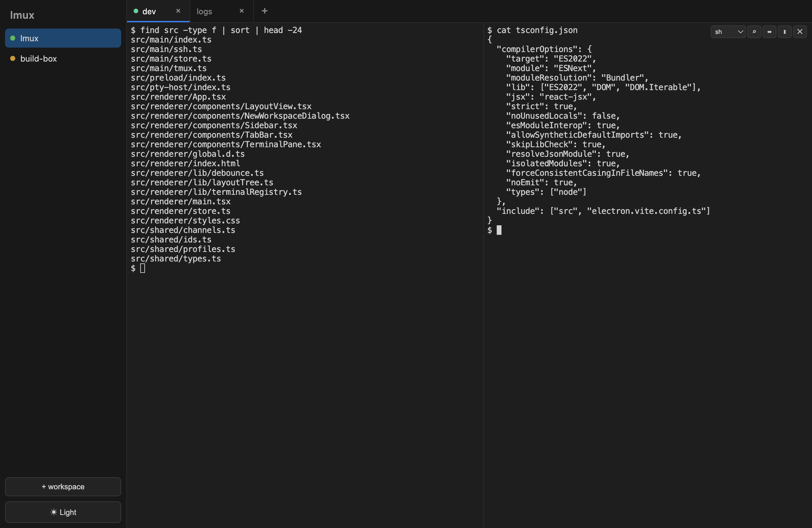

# lmux

A GUI terminal multiplexer where every terminal is backed by a tmux session — so
quitting and reopening reconnects to your live sessions, locally or over SSH.



## Features

- **Workspaces** in a sidebar — create, rename, delete, and reorder; each is local or SSH.
- **Tabs** per workspace and **split panes** (horizontal + vertical) with draggable dividers.
- **tmux-backed** — every terminal lives in its own tmux session, so processes keep
  running when you quit the app; relaunching reattaches them.
- **SSH workspaces** — pick a host when you create one (autocompletes from your SSH
  config) and it auto-reconnects with backoff after a drop or a remote reboot.
- **AI session auto-resume** — a workspace's main pane can re-run `claude --continue` /
  `codex resume --last` in its project directory whenever a session comes back, so your
  agent picks up where it left off.
- **Light & dark themes**, in-terminal search (⌘F), clickable links, and ⌘W to close a pane.

## Develop

```bash
npm install
npm run dev        # run in development
npm run package    # build a macOS .dmg
```

## License

MIT
